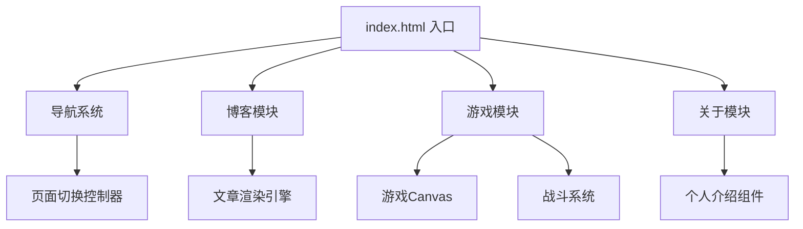
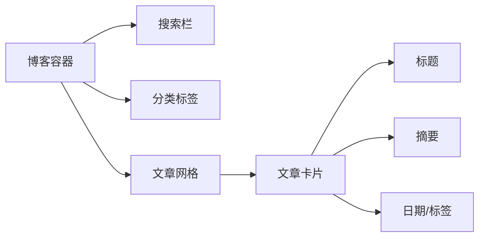
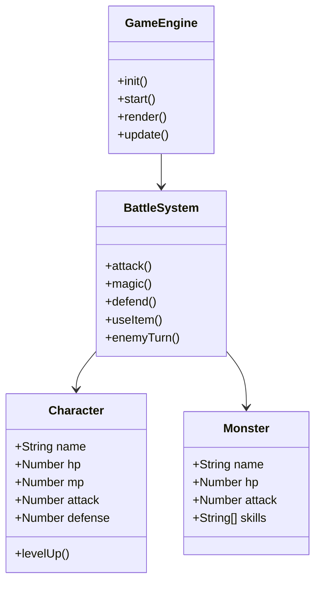
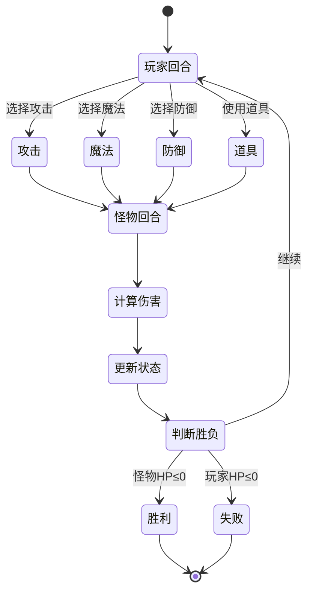

# 个人博客收录网页 - 技术架构文档

## 1. 系统概述

### 1.1 项目架构
采用纯前端静态网页架构，使用HTML5 + CSS3 + Vanilla JavaScript实现，无需后端服务。

### 1.2 文件结构
```
/workspace/
├── index.html          # 主页面入口
├── css/
│   └── styles.css      # 全局样式与米山舞美学实现
├── js/
│   ├── main.js         # 导航、页面切换、交互逻辑
│   └── game.js         # 勇者斗恶龙游戏引擎
└── assets/             # 静态资源（内联SVG/CSS生成）
```

## 2. 技术实现方案

### 2.1 页面架构设计



### 2.2 米山舞美学实现方案

| 视觉元素 | 实现方式 |
|---------|---------|
| 高对比配色 | CSS变量定义渐变系统 |
| 光影效果 | box-shadow + radial-gradient |
| 噪点纹理 | SVG filter + CSS backdrop-filter |
| 几何装饰 | CSS clip-path + pseudo-elements |
| 粒子特效 | CSS keyframes + Canvas |
| 动态倾斜 | transform: skew() + rotate() |

### 2.3 字体方案
- **标题字体**: 'Bebas Neue' - 强烈的视觉冲击力
- **正文字体**: 'Noto Sans SC' - 中日文兼容
- **游戏字体**: 'Press Start 2P' - 像素风格复古感

### 2.4 色彩系统 (CSS Variables)
```css
:root {
  --bg-primary: #1a0a2e;
  --bg-secondary: #16213e;
  --accent-cyan: #00d4ff;
  --accent-magenta: #ff006e;
  --accent-gold: #ffb700;
  --accent-green: #39ff14;
  --text-primary: #ffffff;
  --text-secondary: #b8b8d0;
  --gradient-hero: linear-gradient(135deg, #1a0a2e 0%, #0f3460 50%, #1a0a2e 100%);
  --glow-cyan: 0 0 20px rgba(0, 212, 255, 0.5);
}
```

## 3. 博客模块设计

### 3.1 组件结构


### 3.2 数据结构
```javascript
const blogPosts = [
  {
    id: 1,
    title: "WebGL粒子效果实践",
    summary: "探索WebGL在粒子系统中的强大表现力...",
    category: "技术",
    date: "2026-05-01",
    tags: ["WebGL", "Canvas", "动画"],
    color: "#00d4ff"
  },
  // ...更多文章
];
```

### 3.3 交互逻辑
- 分类筛选：点击标签过滤文章
- 搜索：实时过滤标题和摘要
- 卡片悬停：放大 + 发光效果

## 4. 游戏模块设计

### 4.1 游戏引擎架构


### 4.2 战斗流程


### 4.3 角色属性设计
| 属性 | 初始值 | 每级增长 |
|------|--------|---------|
| HP   | 50     | +15     |
| MP   | 20     | +8      |
| 攻击力 | 12    | +4      |
| 防御力 | 8     | +3      |

### 4.4 怪物图鉴
| 怪物 | HP | 攻击力 | 经验值 | 特殊技能 |
|------|-----|--------|--------|---------|
| 史莱姆 | 30 | 5 | 10 | 分裂 |
| 骷髅战士 | 60 | 12 | 25 | 骨刃 |
| 暗影法师 | 45 | 18 | 35 | 暗影箭 |
| 巨龙 | 150 | 25 | 100 | 龙息 |

## 5. 渲染与动画方案

### 5.1 页面过渡动画
- 使用CSS `transition` + `opacity` 实现淡入淡出
- 使用 `transform: translateY()` 实现上下滑动
- 导航切换时添加 `staggered` 延迟效果

### 5.2 游戏渲染
- 使用Canvas API绘制游戏场景
- 像素艺术风格的精灵绘制
- 战斗动画使用帧动画 + 补间效果

### 5.3 特效实现
- **光晕效果**: `box-shadow` + `text-shadow`
- **粒子背景**: Canvas粒子系统
- **噪点纹理**: SVG filter
- **渐变背景**: CSS `linear-gradient` + `radial-gradient`

## 6. 性能优化策略

### 6.1 加载优化
- 内联关键CSS
- 字体使用Google Fonts CDN
- 图片使用SVG内联替代

### 6.2 渲染优化
- 使用 `will-change` 优化动画元素
- 游戏使用 `requestAnimationFrame`
- 避免频繁DOM操作

### 6.3 内存优化
- 及时清理事件监听器
- 游戏对象池复用
- 避免内存泄漏

## 7. 响应式设计

### 7.1 断点定义
```css
/* 移动端 */
@media (max-width: 768px) {
  /* 单列布局 */
}

/* 平板 */
@media (min-width: 769px) and (max-width: 1024px) {
  /* 双列布局 */
}

/* 桌面 */
@media (min-width: 1025px) {
  /* 三列布局 */
}
```

### 7.2 游戏响应式
- Canvas尺寸根据容器自适应
- 控制按钮尺寸适配触屏操作

## 8. 开发计划

| 阶段 | 任务 | 产出 |
|------|------|------|
| 1 | 页面骨架与导航 | HTML结构 + 导航逻辑 |
| 2 | 博客模块 | 文章展示 + 筛选 |
| 3 | 游戏引擎 | Canvas渲染 + 战斗系统 |
| 4 | 米山舞美学实现 | 样式 + 特效 |
| 5 | 响应式适配 | 移动端兼容 |
| 6 | 测试与优化 | 性能调优 |

## 9. 技术约束与风险

### 9.1 约束
- 纯前端实现，无后端支持
- 游戏数据存储在内存中（刷新丢失）
- 依赖浏览器Canvas API支持

### 9.2 风险缓解
- 使用LocalStorage实现简单存档
- 提供浏览器兼容性提示
- 降级方案：游戏简化模式
