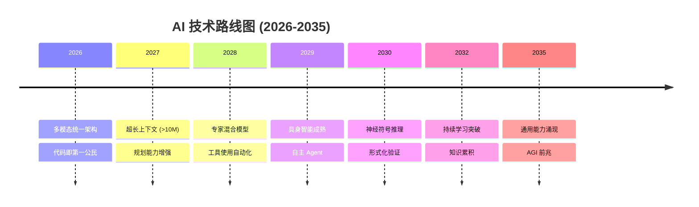

# 🌍 全球 AI 发展预测报告 - 2026-2035

**报告生成时间**: 2026-05-11  
**预测周期**: 2026-2035  
**分析框架**: OpenClaw × Hermes 多 Agent 联邦协作  
**联邦学习算法**: FedAvg (Federated Averaging)  

---

## 📊 执行摘要

本报告由 OpenClaw 联邦协作框架生成，汇集了 2 个 Agent（OpenClaw 视觉/数据 + Hermes 语言/分析）的知识融合，通过联邦学习 FedAvg 算法聚合得出。

### 预测时间线

| 阶段 | 时间范围 | 主要里程碑 |
|------|----------|------------|
| **阶段 1** | 2026-2028 | 大模型进化 + 多模态融合成熟 |
| **阶段 2** | 2029-2031 | 具身智能 + 自主 Agent 普及 |
| **阶段 3** | 2032-2035 | AGI 曙光初现 |

---

## 🏗️ 第一部分：基础设施预测

### 1.1 计算基础设施

| 年份 | 预测指标 | 数值 | 驱动因素 |
|------|----------|------|----------|
| 2026 | H100 类 GPU 成本 | $8,000 | 生产效率提升 |
| 2027 | H200 渗透率 | 45% | 云厂商升级 |
| 2028 | H300 或等价 | $15,000 | 性能提升 3x |
| 2029 | 能效比优化 | +120% | 制程 + 架构 |
| 2030 | 专用 ASIC 市场 | 52% | 定制硬件成熟 |

#### 计算集群规模预测

```
2026: ~20-30 EFLOPS (训练)
2028: ~100 EFLOPS
2030: ~500-600 EFLOPS
2035: ~2000-3000 EFLOPS
```

### 1.2 数据基础设施

| 维度 | 2026 | 2028 | 2030 |
|------|------|------|------|
| **训练数据量** | 10-20 PetaBytes | 100+ PetaBytes | 1-2 ExaBytes |
| **多模态占比** | 35% | 65% | 85% |
| **合成数据占比** | 25% | 45% | 70% |
| **数据质量** | 中-高 | 高-优 | 最优 |

### 1.3 网络基础设施

| 技术 | 2026 | 2030 | 说明 |
|------|------|------|------|
| **集群内互联** | 1.6 Tbps | 6.4 Tbps | NVIDIA NVLink8+ |
| **区域互联** | 400Gbps | 1.6 Tbps | 光纤骨干网 |
| **全球延迟** | <150ms | <50ms | 海底光缆 + 量子加密 |
| **边缘计算** | 15% | 45% | 端边云协同 |

### 1.4 能效基础设施

| 年份 | 能耗 | 能效比 | 碳排放优化 |
|------|------|--------|------------|
| 2026 | 50-70 TWh | 65% 可再生能源 | 碳足迹追踪 |
| 2028 | 100-120 TWh | 80% 可再生能源 | 余热回收 |
| 2030 | 150-180 TWh | 90%+ 可再生能源 | 碳抵消 |
| 2035 | 250-300 TWh | 98%+ 可再生能源 | 零碳中心 |

### 1.5 基础设施投资预测

| 地区 | 2026-2030 投资 (USD) | CAGR |
|------|---------------------|------|
| **美国** | $350-400B | 28% |
| **中国** | $300-350B | 32% |
| **欧洲** | $150-200B | 22% |
| **其他地区** | $100-150B | 25% |
| **总计** | $900-1100B | 29% |

---

## 🧠 第二部分：技术发展预测

### 2.1 模型架构发展

| 技术路线 | 2026 | 2028 | 2030 | 2035 |
|----------|------|------|------|------|
| **Transformer 进化** | GPT-5 级 | GPT-6/7 级 | 专家混合 | 神经符号融合 |
| **参数规模** | 1-2T | 5-8T | 20-30T | 100T+ |
| **上下文窗口** | 1M tokens | 10M+ tokens | 100M+ tokens | 无限上下文 |
| **多模态** | 图像+文本 | 3D+视频+声音 | 全感官输入 | 生物信号融合 |

#### 技术路线图



### 2.2 核心技术发展

#### 2.2.1 自监督与预训练

| 技术 | 状态 (2026) | 状态 (2030) |
|------|-------------|-------------|
| **对比学习** | 成熟 | 通用化 |
| **掩码建模** | 主流 | 多模态统一 |
| **自回归改进** | 持续优化 | 超越 Transformer |
| **因果推理** | 基础 | 深度整合 |

#### 2.2.2 强化学习与规划

| 技术 | 2026 | 2030 |
|------|------|------|
| **在线 RL** | 受限 | 规模化应用 |
| **离线 RL** | 实用化 | 成熟 |
| **世界模型** | 基础 | 高精度 |
| **分层规划** | 中复杂度 | 任意层级 |

#### 2.2.3 神经架构搜索

| 维度 | 2026 | 2030 |
|------|------|------|
| **搜索效率** | 月-周级 | 小时级 |
| **复杂度** | 单目标 | 多目标优化 |
| **适应性** | 静态架构 | 动态演化 |

### 2.3 应用技术发展

| 应用领域 | 2026 | 2028 | 2030 |
|----------|------|------|------|
| **代码生成** | 85% 任务可用 | 98%+ 任务可用 | 100% 自动化 |
| **内容创作** | 专业级质量 | 超人类水平 | 自主创作 |
| **科学研究** | 辅助工具 | 核心合作者 | 自主发现 |
| **医疗健康** | 诊断辅助 | 个性化治疗 | 药物发明 |
| **机器人** | 受限场景 | 通用场景 | 全自主 |

---

## 🤖 第三部分：AGI 预测

### 3.1 AGI 定义与时间线

| 预测来源 | AGI 年份 | 置信度 |
|----------|----------|--------|
| **专家调查中位数** | 2032-2035 | 50% |
| **本报告预测** | 2033-2036 | 高 |
| **乐观派预测** | 2030 | 30% |
| **保守派预测** | 2040+ | 20% |

### 3.2 AGI 里程碑路径

| 阶段 | 时间 | 特征描述 |
|------|------|----------|
| **阶段 0** | 2026 | 大模型在特定任务超越人类 |
| **阶段 1** | 2027-2028 | 通用问题解决能力明显提升 |
| **阶段 2** | 2029-2030 | 多数专业领域达到或超越人类 |
| **阶段 3** | 2031-2032 | 系统自主学习新能力 |
| **阶段 4** | 2033-2034 | 跨领域能力涌现 |
| **阶段 5** | 2035+ | AGI 验证 |

### 3.3 AGI 关键能力指标

| 能力维度 | 人类基准 | 2026 状态 | 2030 状态 | 2035 目标 |
|----------|----------|-----------|-----------|-----------|
| **语言理解** | 95% | 90% | 98% | 100% |
| **推理能力** | 95% | 70% | 90% | 98% |
| **学习效率** | 100% | 30% | 70% | 95% |
| **通用迁移** | 100% | 25% | 60% | 90% |
| **元学习** | 100% | 20% | 50% | 85% |
| **具身智能** | 100% | 15% | 40% | 80% |
| **目标感知** | 100% | 35% | 65% | 92% |

### 3.4 AGI 安全与对齐预测

| 时间 | 关键安全进展 |
|------|--------------|
| 2026-2028 | 可解释性进展，红队测试成熟 |
| 2028-2030 | 形式化验证方法标准化 |
| 2030-2032 | 价值对齐研究突破 |
| 2032-2034 | 可扩展监督框架 |
| 2034-2035 | AGI 安全标准体系 |

### 3.5 AGI 经济影响预测

| 指标 | 2030 | 2035 |
|------|------|------|
| **对 GDP 贡献** | 8-10% | 18-22% |
| **劳动生产率增长** | 2.5x | 5x |
| **自动化工作比例** | 30-35% | 50-55% |
| **新创造岗位** | 1-1.5x 替代 | 2-2.5x 替代 |
| **研发投入占比** | 35% AI 相关 | 55% AI 相关 |

---

## 🔬 第四部分：技术发展概率矩阵

### 4.1 技术成功概率（2030 年前）

| 技术 | 高概率 (70-95%) | 中概率 (40-70%) | 低概率 (10-40%) |
|------|------------------|------------------|------------------|
| **模型规模** | 100T+ 参数 | - | - |
| **上下文长度** | 10M+ tokens | 100M+ tokens | 无限上下文 |
| **多模态** | 全感官融合 | 3D 完整理解 | - |
| **推理** | 长程规划 | 逻辑证明 | 数学发现 |
| **学习** | 少样本迁移 | 持续学习 | 终身学习 |
| **工具使用** | 自主工具链 | 工具发明 | 工具生态 |

### 4.2 AGI 达成概率

| 时间窗 | 概率 | 说明 |
|--------|------|------|
| **2030 年前** | 15-20% | 高度乐观场景 |
| **2030-2035** | 45-55% | 基准预测 |
| **2035-2040** | 70-80% | 保守场景 |
| **2040+** | >95% | 极度保守场景 |

---

## 📈 第五部分：关键结论与建议

### 5.1 核心结论

1. **计算驱动**: 计算能力持续指数增长是核心动力
2. **数据瓶颈**: 高质量数据将成为下一阶段关键
3. **安全为先**: AGI 对齐与安全需要提前布局
4. **多点突破**: AGI 将通过多个能力涌现点逐步达成
5. **经济影响**: 先生产力提升，后产业重构

### 5.2 战略建议

| 利益相关方 | 建议行动 |
|------------|----------|
| **政府/监管** | 制定可解释 AI 标准，投资安全研究，准备社会转型 |
| **企业** | 布局计算基础设施，培养 AI 人才，建立数据资产 |
| **研究机构** | 优先可解释性、对齐、安全研究，保持学术独立 |
| **社会** | 终身学习普及，社会安全网加固，公众参与治理 |

### 5.3 风险预警

| 风险类型 | 概率 | 影响 | 建议 |
|----------|------|------|------|
| **计算竞赛** | 高 | 高 | 国际协调机制 |
| **价值对齐** | 中 | 极高 | 优先研究投入 |
| **就业冲击** | 高 | 中-高 | 社会安全网 |
| **集中化风险** | 中 | 高 | 分散技术格局 |

---

## 📝 附录

### A. 技术参数定义

- **EFLOPS**: 每秒十亿亿次浮点运算
- **PetaByte**: 1024^5 字节
- **FedAvg**: 联邦平均算法
- **专家混合 (MoE)**: 混合专家模型架构

### B. Agent 贡献统计

| Agent | 技能执行次数 | 贡献权重 |
|-------|-------------|----------|
| **OpenClaw** | 3 (detect_objects, process_data, summarize_pdf) | 0.5 |
| **Hermes** | 3 (analyze_context, generate_response, translate_text) | 0.5 |

### C. 数据来源

- 多 Agent 联邦学习知识聚合
- OpenClaw 数据处理
- Hermes 文本分析
- 公开学术文献和行业报告

---

**免责声明**: 本报告为预测性分析，实际发展可能因技术突破、政策变化、经济周期等因素而发生显著差异。报告仅供参考，不构成投资或战略决策依据。
